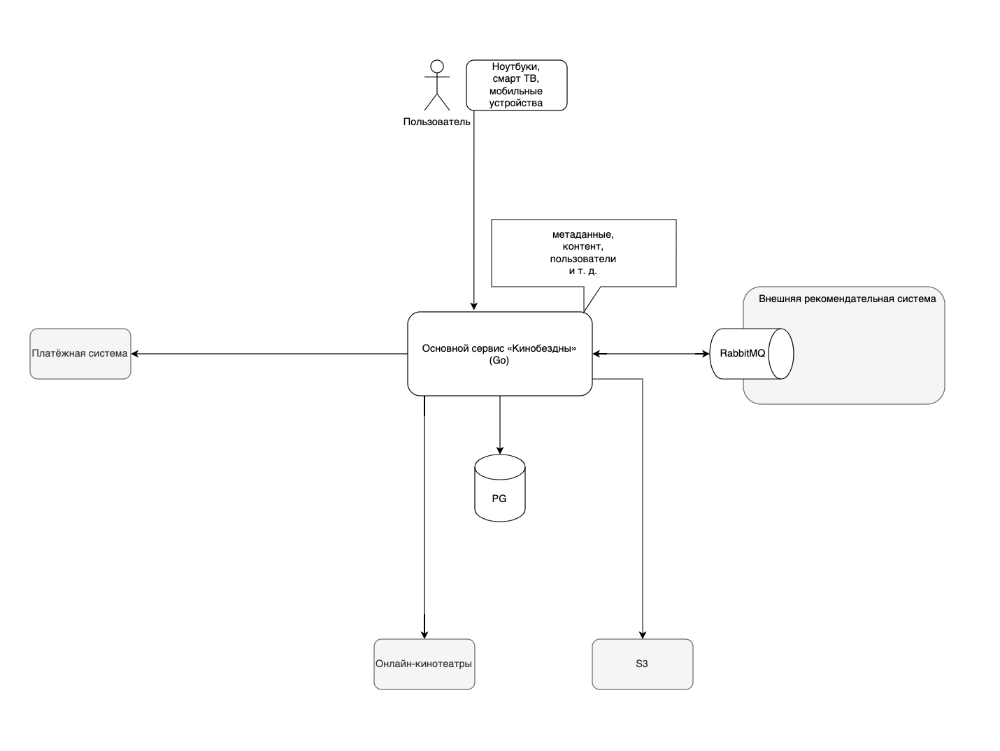
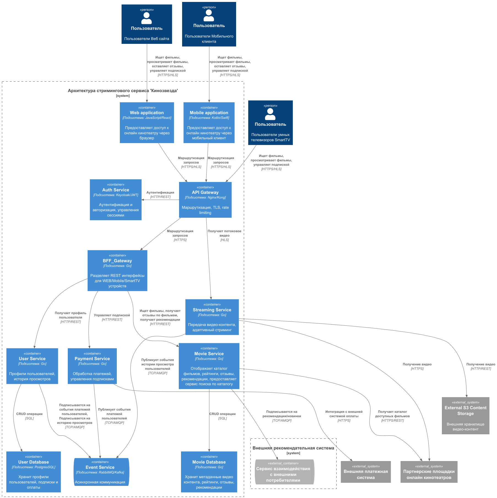

# О компании

Небольшой стартап «Кинобездна» пять лет назад организовал стриминговый сервис, где пользователи могут посмотреть контент из других сервисов и открытых источников по единой подписке.
Стартап вырос и превратился в крупный онлайн-кинотеатр — агрегатор. Кратно выросло количество пользователей и различных интеграций с сервисами лояльности, маркетплейсами, платёжными системами и так далее.

### 1.Текущее решение

* Большой и запутанный монолит на Go c СУБД PostgreSQL.
* Одна база данных.
* Сущности в базе: платежи, пользователи, видео, подписки, скидки, метаданные о фильмах (жанры, актёры, оценки).
* Все вызовы за исключением взаимодействия с рекомендательной системой сейчас происходят синхронно. Пользователь открывает сайт, аутентифицируется, выбирает фильм, может оценить фильм и составить папку с избранным.
* Сторонняя рекомендательная система делает подборку.
* API компании построено в соответствии с REST-стилем.
* Клиенты сервиса используют мобильные устройства, ноутбуки, смарт ТВ. Как следствие, на разных девайсах различаются интерфейсы и количество данных.

### 2.Целевая экосистема, которую необходимо создать

* Компании нужно повысить надёжность и улучшить масштабируемость системы за счёт использования Kubernetes и его возможностей оркестрации.
* Для оперативного внесения изменений нужно разделить кодовую базу и домены путём выделения микросервисов из монолита.
* Для быстроты доставки приложения в продакшн необходимо внедрить и настроить CI/CD-процесс.
* Переход должен произойти без простоя и незаметно для пользователей.

### 3.Лэндскейп компании

Над проектом работают:

* Команда разработчиков. В ней пять человек, специализирующихся на Go. Разработчики будут работать над рефакторингом и разделением монолита на микросервисы.
* Команда DevOps. Два человека, которые будут настраивать CI/CD-пайплайны, контейнеризацию и оркестрацию.
* Команда QA. В ней два человека. Они будут проводить тестирование новой системы.Команда по продажам и маркетингу. В команде пять человек, она будет заниматься продвижением кинотеатра.

### 4.Цели бизнеса

* Описана As-Is и To-Be архитектура решения. Создан план по переходу к целевой системе.
* Вынесен микросервис, отвечающий за метаданные. Вся система перенесена в Kubernetes с использованием Helm.
* Сделано MVP с использованием Kafka для дальнейшего развития.
* Настроены CI/CD-пайплайны.

# Задание 1

Спроектируйте to be архитектуру КиноБездны, разделив всю систему на отдельные домены и организовав интеграционное взаимодействие и единую точку вызова сервисов.

